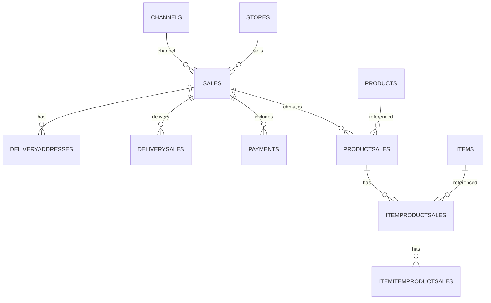

# PRD: Nola Analytics – Plataforma de BI para Restaurantes

## 1. Visão Geral
"Nola Analytics" é uma plataforma de analytics dedicada a donos de restaurantes brasileiros, como Maria. O objetivo é permitir a exploração flexível e intuitiva de grandes volumes de dados operacionais (500k+ transações) sem dependência de dashboards fixos ou conhecimento técnico. O desafio central é garantir performance (<1s por query) e facilidade de uso para proporcionar respostas rápidas—exemplo: “Qual produto vende mais na quinta à noite no iFood?”—sem complexidade de ferramentas como Power BI.

## 2. Sobre o Produto
A plataforma conecta-se diretamente a um banco PostgreSQL populado, refletindo dados reais de vendas e operações. É "opinionada" para o contexto de restaurantes: Ticket Médio, vendas por canal, análise de customizações, performance de loja e KPIs operacionais. Maria, a persona central, enfrenta dificuldades com ferramentas de BI genéricas e dashboards limitados, demandando autonomia para análises customizadas sem depender de especialistas.

## 3. Propósito
Empoderar Maria—e outros donos de restaurantes—com autonomia analítica, fornecendo meios para identificar oportunidades, gargalos e tendências cruciais ao negócio, tornando dados brutos em decisões práticas.

## 4. Público Alvo
Persona: Maria, empresária, 3 restaurantes, baixa fluência tecnológica, rotina ocupada. Precisa de insights estratégicos rápidos para decisões diárias, sem curva de aprendizado ou dependência de times técnicos.

## 5. Objetivos
- Permitir criação de dashboards customizados em < 5 minutos.
- Garantir que 90% das queries de exploração retornem em < 1s.
- Facilitar filtro, agregação e visualização para KPIs-chave.

## 6. Requisitos Funcionais
- **RF-01: Autenticação (Mock).**
- **RF-02: Dashboard Principal (Overview).**
- **RF-03: Exploração de Dados (Query Builder Visual):** seleção de métricas, dimensões e filtros de forma visual.
- **RF-04: Visualização de Dados:** variados formatos (gráficos barra, linha, pizza, tabelas).
- **RF-05: Gestão de Dashboards:** salvar, carregar e editar composições de múltiplas visualizações.

## 7. Flowchart UX – Criação de Novo Gráfico
```mermaid
flowchart TD
    Start(Start) --> SelectMetric[Selecionar Métrica]
    SelectMetric --> SelectDimension[Escolher Dimensão]
    SelectDimension --> AddFilter[Adicionar Filtro (opcional)]
    AddFilter --> ChooseVis[Escolher Tipo de Gráfico]
    ChooseVis --> RenderVis[Visualizar Gráfico]
    RenderVis --> SaveDash[Salvar no Dashboard]
```

## 8. Requisitos Não-Funcionais
- **RNF-01: Performance.** Resposta < 1s p/ 90% das queries.
- **RNF-02: Usabilidade.** Foco extremo em intuição; interface clara para usuários não-técnicos.
- **RNF-03: Conectividade.** Integração direta com PostgreSQL.
- **RNF-04: UI em PT-BR, código em inglês.**

## 9. Arquitetura Técnica
- **Backend:** Python (FastAPI) – eficiente, fácil construção de APIs, grande comunidade de otimização para PostgreSQL.
- **Frontend:** React – Create React App ou Next.js, foco em performance e UI reativa.
- **Visualização:** ECharts (JS), integração nativa com React e excelente suporte a gráficos responsivos e complexos.
- **Justificativa:** Stack consolidada para projetos de BI, baixo overhead para prototipagem rápida e grande documentação. Apoio a performance via otimização de queries, índices, uso de materialized views e cache Redis. Possível adoção de DuckDB para engine analítica off-Postgres.

## 10. Arquitetura de Dados — Estratégias
- Queries SQL otimizadas e uso intenso de índices.
- Camada de cache para queries pesadas (Redis).
- Materialized views estratégicas (pré-agregações recorrentes).
- Opção de engine de leitura paralela (DuckDB) se necessário para grandes agregações.

## 11. Estrutura de Dados (Mermaid)


## 12. Design System
- **Paleta:** dark mode (tons azul, cinza, laranja-acento)
- **Fontes:** Inter, Roboto
- **Componentes:** Botões grandes, input claro, cards de gráfico, modais, tabelas densas
- **Lib sugerida:** TailwindCSS (alta customização, rápido protótipo)

## 13. User Stories
### Épico 1: Exploração de Vendas
- US 1.1: Como Maria, quero ver o faturamento total do último mês, filtrado por loja.
- US 1.2: Como Maria, quero um gráfico de barras dos 10 produtos mais vendidos no iFood na última semana.
- US 1.3: Como Maria, quero ver o ticket médio por canal ao longo do tempo (linha).
### Épico 2: Análise Operacional
- US 2.1: Como Maria, quero o tempo médio de entrega por bairro.
- US 2.2: Como Maria, quero saber quais itens adicionais são mais vendidos.
### Épico 3: Gestão de Dashboards
- US 3.1: Como Maria, quero salvar "Produtos Mais Vendidos" em um dashboard "Meu Overview".

## 14. Critérios de Aceite (US 1.2)
- Usuário seleciona canal, período, métrica –< barra exibe "TOP 10 produtos".
- Query retorna em <1s.
- Maria consegue salvar a visualização.
- Visual é responsivo e pode ser adicionado ao dashboard.

## 15. Métricas de Sucesso
- Nº de dashboards criados por usuário
- Tempo médio criação de gráfico
- p90 do tempo de resposta de queries

## 16. Riscos e Mitigações
- **Performance queries (>2s):** Foco em materialized views/cache. Testar consultas durante PoC.
- **Complexidade do query builder:** UX inspirada em Metabase; oferecer perguntas prontas inicialmente.

## 17. Plano de Sprints
- ### Sprint 0: Setup e Arquitetura
- [ ] Backend: Inicializar repositório Django
- [ ] Backend: Configurar ambiente virtual Python
- [ ] Backend: Instalar dependências iniciais (Django, psycopg2, djangorestframework)
- [ ] Backend: Criar estrutura básica de app (core/analytics)
- [ ] Backend: Configurar conexão PostgreSQL
- [ ] Frontend: Inicializar projeto React (Create React App)
- [ ] Frontend: Configurar estrutura inicial de pastas/components
- [ ] Backend: Setup Docker para ambiente de desenvolvimento
- [ ] Frontend: Setup Docker/compose se aplicável
- [ ] Backend: Criar models de teste do banco (1 tabela)
- [ ] Backend: Validar conexão com banco local
- [ ] Backend: Criar endpoint de teste
- [ ] Frontend: Testar conexão com backend/API
- [ ] Backlog Refinement: Validar escopo com stakeholders
- Dependências: Ambiente funcionando antes de avançar para queries

### Sprint 1: Prova de Conceito Analytics
- [ ] Backend: Mapear schema principal (sales, stores, products)
- [ ] Backend: Criar model completo conforme schema
- [ ] Backend: Implementar seed inicial para testar queries
- [ ] Backend: Criar endpoint /api/analytics/query (aceitar filtros básicos)
- [ ] Backend: Traduzir definição JSON para query SQL
- [ ] Backend: Implementar lógica de query agregada (ex: SUM(total_amount) por store)
- [ ] Backend: Testar queries complexas com volume realista (~500k)
- [ ] Backend: Medir tempo resposta, logar KPIs
- [ ] Backend: Implementar logs de performance
- [ ] Backend: Criar testes unitários para queries
- [ ] Backend: Documentar endpoints iniciais
- Dependências: Models e conexão funcionando para testes reais

### Sprint 2: Filtros e Visualizações
- [ ] Backend: Expandir endpoint para múltiplos filtros (por período, canal, produto)
- [ ] Backend: Implementar paginacão de resultados
- [ ] Backend: Otimizar queries (análises EXPLAIN, índices)
- [ ] Backend: Implementar cache simples para queries frequentes
- [ ] Backend: Criar endpoint para retornar metadados para frontend (campos disponíveis)
- [ ] Frontend: Criar componentes de filtro visual (DatePicker, Select Dinâmico)
- [ ] Frontend: Integrar chamada ao endpoint /api/analytics/query
- [ ] Frontend: Implementar visualização de gráfico básico (barra)
- [ ] Frontend: Implementar visualização de tabela
- [ ] Frontend: Testar múltiplas visualizações simultâneas
- [ ] Frontend: Criar loader/spinner de estado
- Dependências: Endpoint robusto no backend liberado para frontend consumir

### Sprint 3: Gestão e Persistência de Dashboards
- [ ] Backend: Modelar Dashboard e Chart como entidades
- [ ] Backend: Criar endpoints CRUD para Dashboard e Chart
- [ ] Backend: Implementar autenticação mock (User hardcoded/token estático)
- [ ] Backend: Validar permissão de acesso para CRUD
- [ ] Frontend: Criar tela "Salvar Dashboard" e interface para edição de dashboards
- [ ] Frontend: Implementar modal para salvar/renomear re-visualizações
- [ ] Frontend: Renderizar múltiplos gráficos em um dashboard
- [ ] Frontend: Implementar feedback visual de sucesso/erro
- [ ] Backend: Testes automatizados das permissões e endpoints
- Dependências: Modelos persistidos e autenticação funcionando

### Sprint 4: Polimento, QA e Documentação
- [ ] Backend: Revisar todos os testes automatizados
- [ ] Backend: Revisão de queries (performance, cache, índices)
- [ ] Backend: Revisar documentação dos endpoints
- [ ] Frontend: Revisar responsividade (diversos tamanhos de tela)
- [ ] Frontend: Testar experiência de Maria (usabilidade, fluxos principais)
- [ ] Frontend: Implementar tema dark final
- [ ] Backend: Criar scripts de setup e mocks para demo
- [ ] Frontend: Gravar vídeo demo funcional
- [ ] Backend: Preparar README final de entrega
- Dependências: Releases backend e frontend prontos, testes ok

## Relação de Dependências
- Ambiente e models (Sprint 0) habilitam PoC de queries reais (Sprint 1)
- Queries analíticas básicas (Sprint 1/2) habilitam filtros e visualizações do frontend (Sprint 2)
- Persistência/crud de dashboards (Sprint 3) dependem de models e endpoints do backend
- Polimento/finalização só possível após recursos principais estarem implementados (Sprint 4)


---